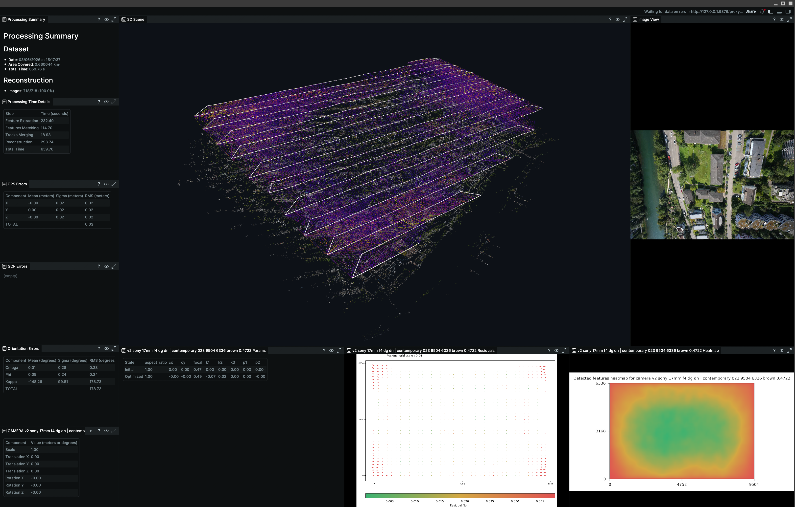

OpenSfM
=======
[](https://github.com/OpenSfM/OpenSfM/actions/workflows/conda.yml) [](https://github.com/OpenSfM/OpenSfM/actions/workflows/docker_ubuntu20.yml) [](https://github.com/OpenSfM/OpenSfM/actions/workflows/docker_ubuntu24.yml)
 
[](https://github.com/OpenSfM/OpenSfM/actions/workflows/coverage.yml)

[](https://discord.gg/KrtV85kvgR)

## 🧟 Intro
This repository continues the original [OpenSfM](https://github.com/mapillary/opensfm) project, which is no longer in active development. We were maintainers and contributors of the original OpenSfM, and we will do our best to keep it alive and serve the community and our users ([OpenDroneMap](https://www.opendronemap.org/), [WebODM](https://webodm.org/) and many others).

This **1.0** release focuses on the needs of those two biggest users — OpenDroneMap and WebODM — hence the strong emphasis on **GIS / geo workflows**. See the [release notes](RELEASE.md) for the full feature list.

## 🔭 Overview
OpenSfM is an open-source Structure-from-Motion (SfM) library written in Python with performance-critical code in C++. It reconstructs camera poses and sparse 3D points from unordered image collections, and goes all the way to **dense point clouds, meshes, and georeferenced 2D maps (DSM, orthophoto)** — with GPU acceleration throughout.

**🧩 Core pipeline**

Feature detection (SIFT, HAHOG, DSP-SIFT, AKAZE, SURF, ORB), GPU (OpenCL) matching — both online-trained binary-quantized descriptors and classic FLANN — with geometric verification, track building, and incremental + direct aerotriangulation reconstruction. Robust [Ceres](http://ceres-solver.org/)-based bundle adjustment, switching to a stochastic solver for very large scenes. Pair selection by GPS, capture time, file order, or image similarity (BoW / VLAD). See [pipeline commands](doc/using.md) and the [configuration reference](doc/configuration.md).


**📐 Camera models**

Perspective, Brown, fisheye (OpenCV model and custom 62 / 624 parameters), spherical / equirectangular, and dual — with rolling-shutter correction. Lab-calibrated intrinsics can be injected and frozen, and multi-camera rigs are fully supported and can be auto-calibrated. See [camera models](doc/geometry.md) and [rig models](doc/rig.md).

**🧭 Geolocation & georeferencing**

GPS positions (with per-image X/Y/Z standard deviation) from EXIF or imported from a text file; ground control points and checkpoints (with per-point standard deviation) in any CRS. Horizontal + vertical coordinate systems via EPSG codes, compound EPSG, or PROJ strings, with geoids fetched on demand from the PROJ CDN, and adaptive datum-shift compensation. See [georeferencing & GIS outputs](doc/georeferencing.md) and [ground control points](doc/ground_control_points.md).

**🍇 Dense reconstruction**

Multi-view depth estimation via GPU PatchMatch (OpenCL), sparse-voxel-octree TSDF fusion with optional photometric refinement, and a Surface Nets (dual-contouring) mesh. Exports the dense cloud as PLY / LAS / LAZ, the mesh as PLY, and Potree-style octree tiles for streaming web viewers. See [dense reconstruction & 2D maps](doc/dense.md).


**🧇 2D maps — DSM & orthophoto**

Direct, TSDF-based Digital Surface Model and orthophoto rendering, with hole filling, an edge-sharpening shock filter, and robust multi-view color baking. Accurately georeferenced to the output CRS (3rd-degree polynomial fit, TPS fallback) and exported as GeoTIFF. See [2D maps](doc/dense.md#2d-maps-dsm-and-orthophoto).


**🪜 Scalability**

Out-of-core submodel splitting / merging for large scenes, rig constraints for multi-camera setups, stochastic bundle adjustment, and configurable multi-processing. See [large datasets](doc/large_datasets.md).

**📦 Exports**

COLMAP, Bundler, OpenMVS, PMVS, VisualSFM, PLY, LAS/LAZ, GeoJSON, and GeoTIFF — see [the exporters](doc/using.md#other-exporters).

**🩺 Quality report**

SfM metrics, GPS/GCP and checkpoint error tables, and DSM/ortho previews, localized in metric or imperial units and in five languages (en/fr/es/de/it), exported as a PDF. See [quality report](doc/quality_report.md) and an [example report](doc/images/report.pdf).

**🥽 Visualisation**

A built-in JavaScript viewer for interactive 3D preview and pipeline debugging, a web point-cloud viewer fed by the Potree octree tiles, and a [Rerun](https://rerun.io/) export of the scene with its GPS/GCP data.



**🤝 Compatibility** —
Runs on Linux, macOS (Apple Silicon), and Windows. See the [quickstart](doc/quickstart.md) to get started.

**🫶 Credits** —
OpenSfM was created by Pau Gargallo and bootstrapped by Mapillarians — check out this [blog post with more demos](http://blog.mapillary.com/update/2014/12/15/sfm-preview.html).


## 🛫 Getting Started

Install using conda lock files (see [building instructions](doc/building.md)):

**Linux:**
```bash
conda create --name opensfm --file conda-linux-64.lock --yes
conda activate opensfm && pip install -e .
```

**macOS (Apple Silicon):**
```bash
conda create --name opensfm --file conda-osx-arm64.lock --yes
conda activate opensfm && pip install -e .
```

Then reconstruct a dataset:
```bash
conda activate opensfm
./bin/opensfm_run_all path/to/dataset   # Linux/macOS
bin\opensfm_run_all.bat path\to\dataset  # Windows
```

**Workflow presets** — ready-made `config.yaml` files tuned for common capture types live in [`configs/`](configs/) (`aerial`, `terrestrial`, `object`). Copy one into your dataset to start from sensible defaults: `cp configs/aerial.yaml path/to/dataset/config.yaml`. See [workflow presets](doc/using.md#workflow-presets-configs).

## 📚 Documentation

**Getting Started**
* [Quickstart](doc/quickstart.md)
* [Building & Installation](doc/building.md)
* [Pipeline Commands](doc/using.md)

**User Guide**
* [Dataset structure](doc/dataset.md)
* [Configuration reference](doc/configuration.md)
* [Ground control points](doc/ground_control_points.md)
* [Rig models](doc/rig.md)
* [Large datasets](doc/large_datasets.md)
* [Dense reconstruction & 2D maps](doc/dense.md)
* [Georeferencing & GIS outputs](doc/georeferencing.md)
* [Quality report](doc/quality_report.md)

**Reference**
* [Camera models & coordinate systems](doc/geometry.md)
* [Reconstruction algorithm](doc/reconstruction.md)
* [Sensor / calibration database](doc/sensor_database.md)
* [Reporting](doc/reporting.md)

**Mathematical Notes**
* [Dense matching](doc/dense_matching.md)
* [Reconstruction merging](doc/merging_notes.md)

## ⚖️ License
OpenSfM is BSD-style licensed, as found in the LICENSE file.

Example data in the README is under [Creative Commons CC-BY 4.0 License](https://creativecommons.org/licenses/by/4.0/) by Wingtra AG, 8045 Zürich, Switzerland.