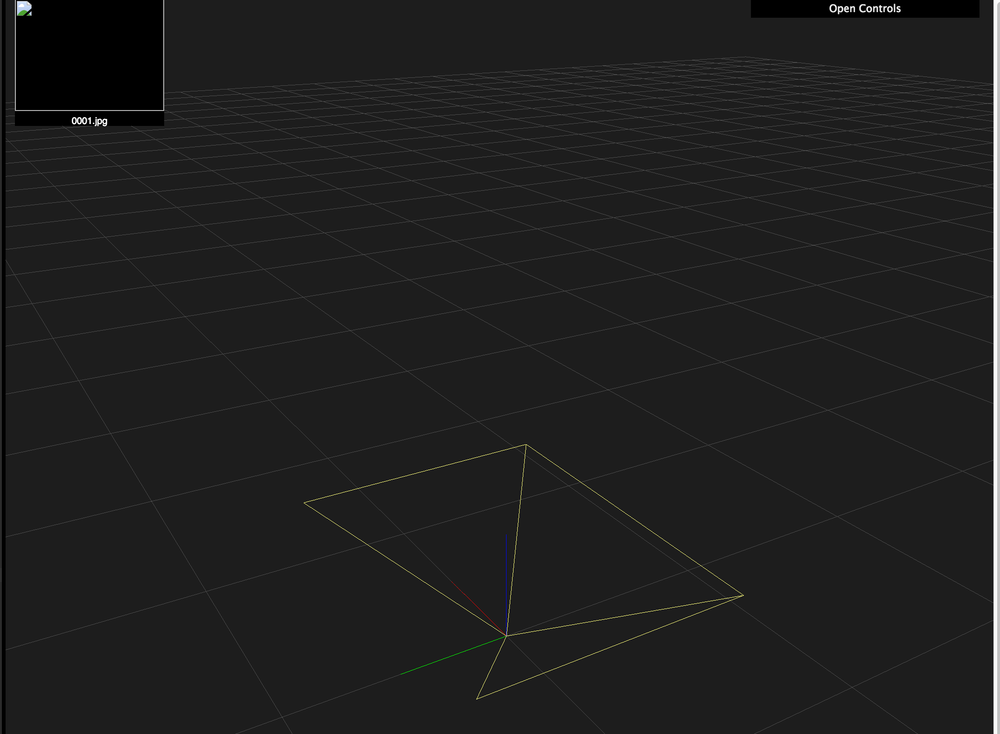

# Camera Coordinate System and Conventions

## Camera

The pose of a camera consists of:

1. Which direction it faces (its local coordinate axes)
2. Where it is (the position of the camera origin)

### Local Coordinate System

From the perspective of a camera (`Shot` object):

- The **z-axis** points **forward**
- The **y-axis** points **down**
- The **x-axis** points to the **right**

In the 3D reconstruction viewer, axes are Red (x), Green (y), Blue (z).

The OpenSfM `Pose` class contains a `rotation` field, representing the local coordinate system as an **axis-angle vector**.

- The **direction** of this 3D vector is the **axis** around which to rotate.
- The **length** of this vector is the **angle** to rotate (in radians).

### Camera Position

To get or set the actual camera position in world coordinates, use `get_origin()` / `set_origin()`.
