# Statistics and Quality Report

The `compute_statistics` command generates a JSON statistics file. The `export_report` command exports it as a PDF report. The report is broken into several subsections documented below.

## Dataset Summary

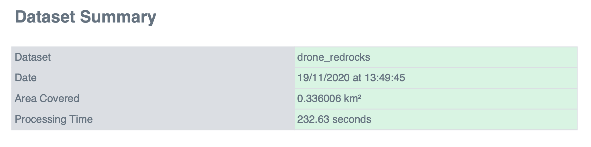

- **Dataset**: name of the dataset's folder
- **Date**: day and time at which `reconstruction.json` was created by the `reconstruct` command
- **Area Covered**: area covered by the bounding box enclosing all cameras
- **Processing Time**: total time for SfM processing (`detect_features`, `match_features`, `create_tracks`, `reconstruct`)

## Processing Summary

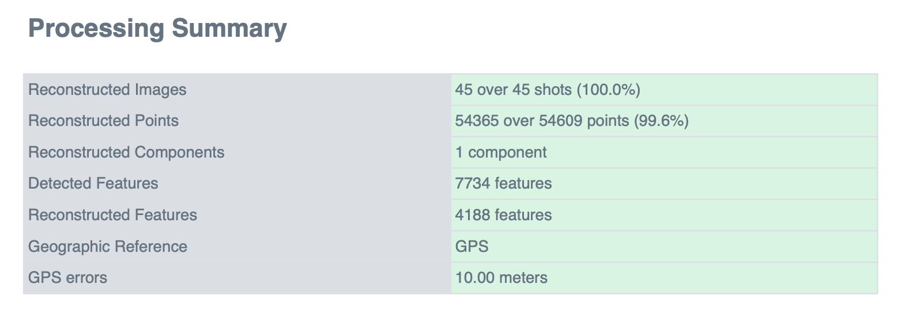

- **Reconstructed Images**: reconstructed images / total images
- **Reconstructed Points**: reconstructed points / total points in `tracks.csv`
- **Reconstructed Components**: number of continuously reconstructed sets of images
- **Detected Features**: median number of detected features across images
- **Reconstructed Features**: median number of reconstructed features across images
- **Geographic Reference**: whether GPS and/or GCP were used for geo-alignment
- **GPS / GCP errors**: GPS and/or GCP RMS errors

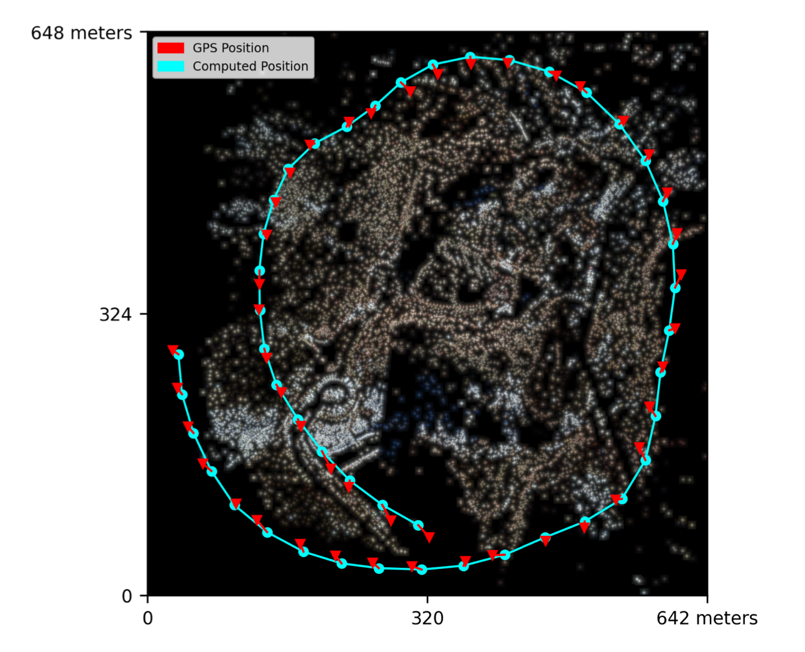

The top-view map shows GPS coordinates of images as blue points and actual reconstructed positions in red. Lines link images in capture order. Reconstructed points are visible as true-color points.

## Features Details

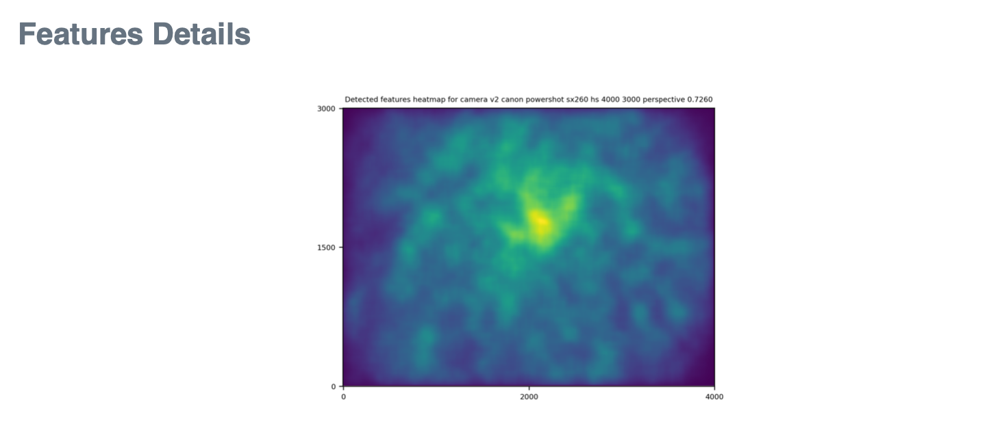

The heatmap shows the density of detected features: blue for none, yellow for the most.

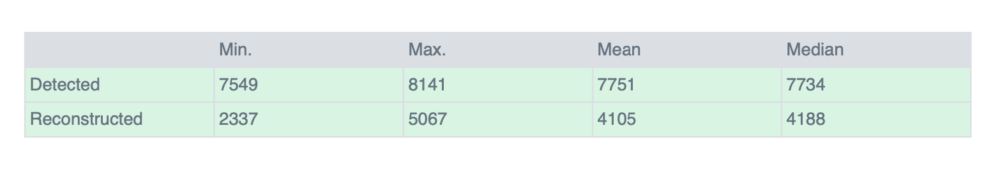

The table lists min/max/mean and median detected and reconstructed features across images.

## Reconstruction Details

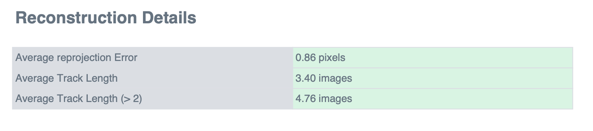

- **Average reprojection error (normalized/pixels)**: normalized and pixel-wise norms of reprojection errors. Errors larger than 4 pixels are pruned.
- **Average Track Length**: average number of images a reconstructed point is detected in.
- **Average Track Length (> 2)**: same, ignoring points seen in only two images.

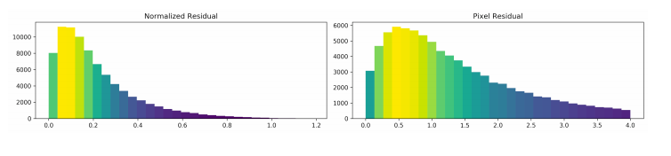

Histogram of normalized and un-normalized reprojection error norms. Errors larger than 4 pixels are pruned.

## Tracks Details

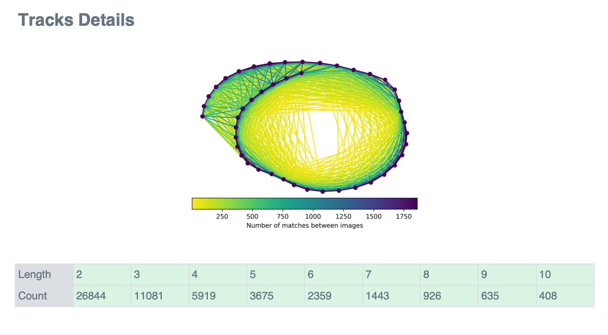

The graph shows image coordinates (GPS-based). Links are colored by number of common detected points between image pairs: yellow for few, blue for the most. Dots are colored by connected component.

The table is a histogram of reconstructed points vs. number of image detections.

## Camera Models Details

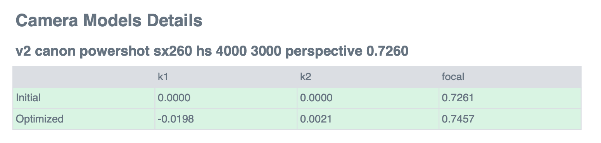

For each camera model: initial values from `camera_models.json` and optimized values from `reconstruction.json`.

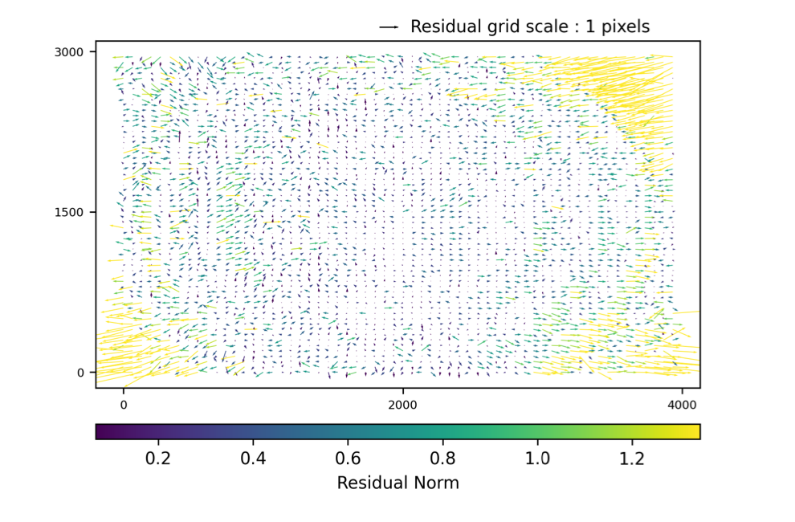

For each camera model: a grid of reprojection errors averaged by fixed-size cells, shown as scaled arrows. Color indicates error norm: yellow for larger, blue for smaller.

## GPS/GCP Errors Details

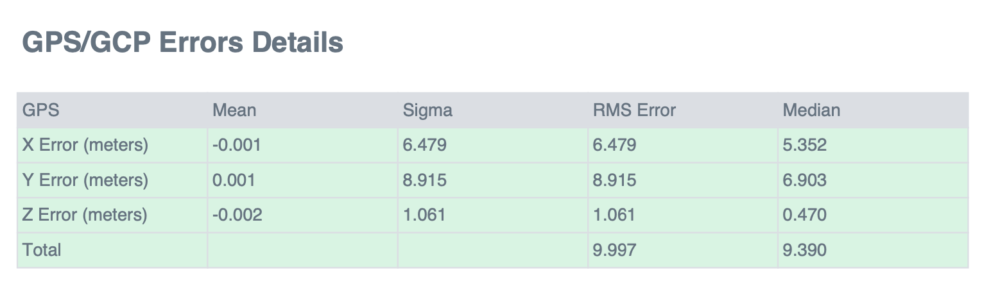

The table lists:
- Per-coordinate (X, Y, Z): sum of errors, median, and standard deviation
- Per-coordinate and total RMS (root mean squared) errors

## Processing Time Details

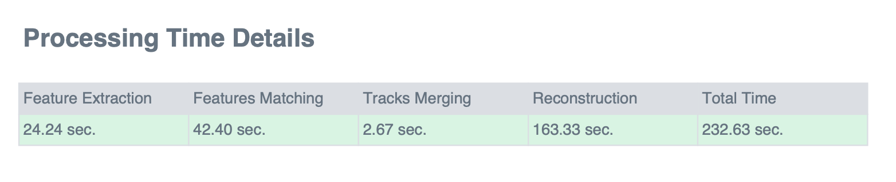

Time breakdown of each SfM step.
