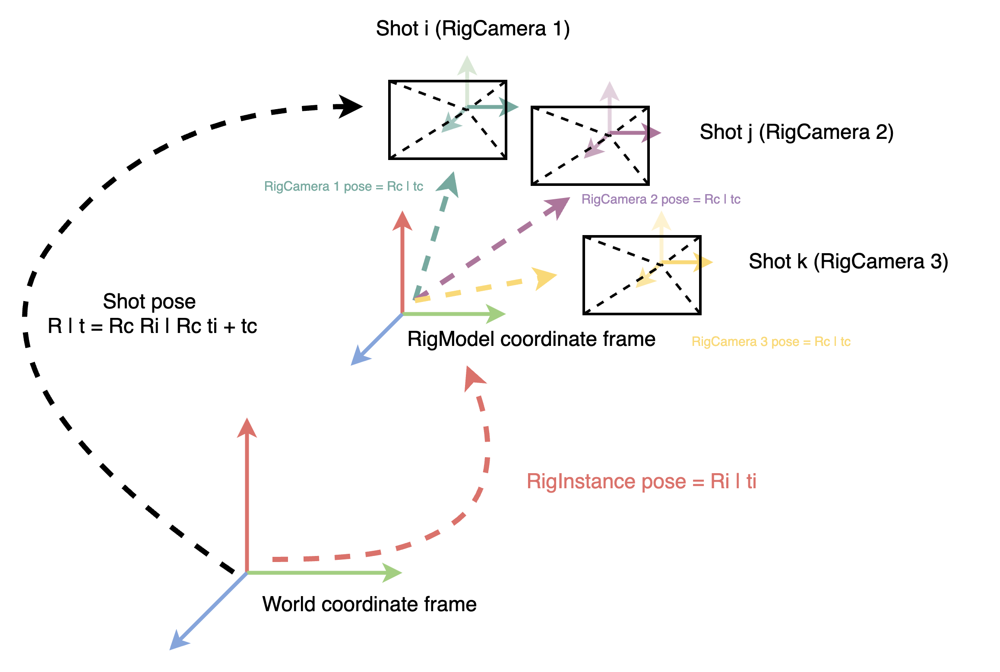

# Rig Models

## Coordinate Systems

Rigs are defined by a fixed assembly of cameras that are triggered at the same instant.
The following terms define such assembly and capture in OpenSfM terminology :

- A `RigCamera` is a camera of the rig assembly defined as a combination of :
    - A projection : an existing camera model (it refers only to its ID) 
    - A pose : the camera pose is defined locally in the rig coordinate frame

    `RigCamera` are defined in the `rig_cameras.json` as the following::

    ```
    {
        "RIG_CAMERA_ID":
        {
            "translation": translation of the rig frame wrt. the RigCamera frame
            "rotation": rotation bringing a point from rig frame to the RigCamera frame
            "camera": camera model ID of this RigCamera
        },
        ...
    }
    ```

    As such, a point `X(rig frame)` defined in the rig frame can be projected in the `RigCamera` frame as `X(rig camera) = R . X(rig frame) + t`

- A `RigInstance` is a list of `Shots` and a pose :
    - Each shot correspond to a `RigCamera`
    - The pose corresponds to the pose of the `RigInstance` in the world
    
    These instances are defined in the `rig_assignments.json` file as follows::

    ```
    {
        "RIG_INSTANCE_ID1": {
            [
                "FILENAME",
                "RIG_CAMERA_ID1"
            ],
            [
                "FILENAME",
                "RIG_CAMERA_ID2"
            ],
            ...
            [
                "FILENAME",
                "RIG_CAMERA_IDn"
            ]
        },
        "RIG_INSTANCE_ID2": {
            [
                "FILENAME",
                "RIG_CAMERA_ID1"
            ],
            [
                "FILENAME",
                "RIG_CAMERA_ID2"
            ],
            ...
            [
                "FILENAME",
                "RIG_CAMERA_IDn"
            ]
        },
        ...
    }
    ```

    As such, a point `X(world)` defined in the world frame can be projected in the `RigInstance` frame as `X(rig instance) = R . X(world) + t`

Alltogether, a point `X(world)` defined in the world frame can be projected in the `RigCamera` frame :

`X(rig camera) = R(camera) . ( R(instance) . X(world) + t(instance) ) + t(camera)`

A picture is often worth many words :


## Usage

Given the above, one can either define manually the `rig_assignments.json` and the `rig_cameras.json`. Bear in mind that the rotation are defined in angle-axis 
convention, and it can be tricky to get the `RigInstance` and `RigCamera` poses right. To help with that, we provide a tool to create the rigs automatically.

The OpenSfM `create_rig` command provides the following workflows :
 - From a set of images and know image names patterns for the rig camera (`--method=pattern `), it automatically creates the `rig_assignments.json` and the `rig_cameras.json` 
 by running SfM on a small subset of the data. This is the most common workflow, and it is described in more details below.
```
./bin/opensfm create_rig DATASET --method=pattern --calibration-type=sfm --definition=PATTERN_DEFINITION
```

 - A variation of the above : if the images have proper EXIF metadata, it can use directly GPS/OPK data to create the rig geometry (`rig_cameras.json`), 
 which can be more accurate and faster to compute than running SfM.

```
./bin/opensfm create_rig DATASET --method={pattern|assignments} --calibration-type=metadata --definition=PATTERN_DEFINITION
```

 - A variation of the two above : if the user has already created the `rig_assignments.json` with the proper rig instances and camera assignments, 
 it can directly run the command to compute the `rig_cameras.json` based on SfM (or metadata if available)
```
./bin/opensfm create_rig DATASET --method=assignments --calibration-type={metadata|sfm} --definition=PATTERN_DEFINITION
```

## Pattern-based Rig creation

The `--definition` takes a JSON string as input to help it defines the rig
instances based on the filenames, such as

    {
        "RIG_CAMERA_ID1": "PATTERN1",
        "RIG_CAMERA_ID2": "PATTERN2",
        ...
    }


Where "PATTERN" is a REGEX with the form (.*) where the part in parenthesis identifies the camera models. For example, it would be "(RED)" or "(GREEN)" for multispectral data (used with `--method=pattern`).

 Based on this instances, it then run SfM on a small subset on the data (or metadata-based initialisation) and infers some averaged rig cameras poses, which are then written to `rig_cameras.json`.

